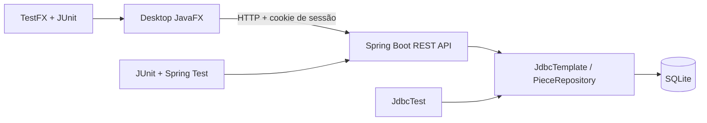
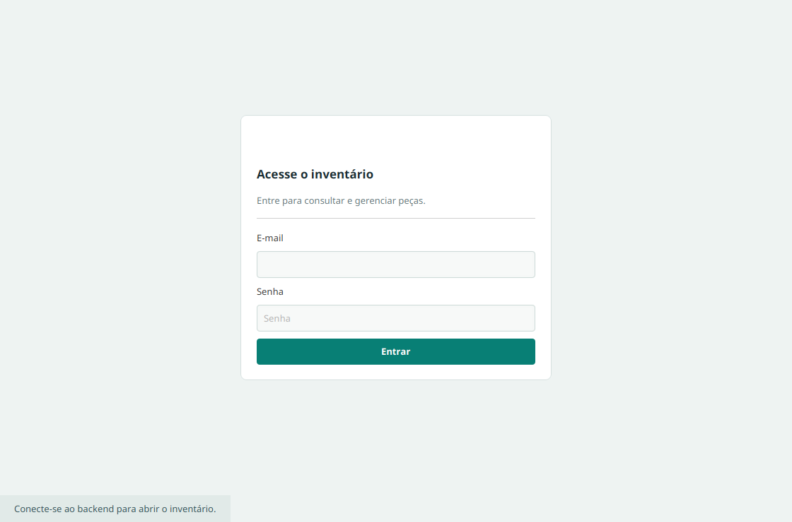
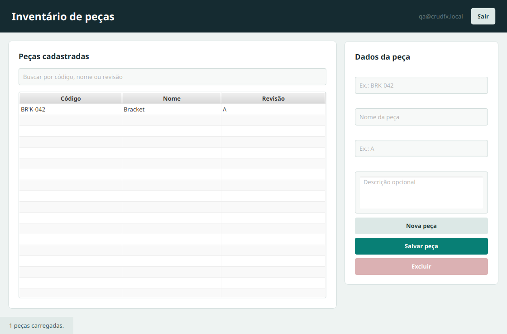

# CRUD FX | Laboratório de QA

> Um pequeno inventário de peças usado como laboratório para praticar QA em uma aplicação Java ponta a ponta: API REST, persistência, autenticação por sessão, interface JavaFX e testes automatizados com JUnit e TestFX.


## Para que serve

O projeto oferece uma aplicação de desktop simples, mas real o bastante para exercitar diferentes níveis de teste:

- **Testes de unidade/integração do backend** para repositório, autenticação e API.
- **Testes de interface com TestFX** para operar a janela JavaFX como uma pessoa usuária.
- **Exploração manual** de login, busca e operações CRUD.
- **Prática de automação**: seletores estáveis, dados de teste, asserts, relatórios e análise de falhas.

> **Importante:** os testes TestFX da janela usam um gateway em memória. Eles verificam os fluxos e o estado exibido pela interface, sem precisar iniciar a API ou acessar o SQLite. Os testes do backend cobrem separadamente persistência e autenticação. Ainda não há teste automatizado que atravesse JavaFX, HTTP e SQLite em uma única execução.

## Visão da aplicação



## Telas da aplicação

As imagens abaixo mostram a tela de entrada e o inventário após autenticação. Foram capturadas da interface JavaFX real usando o harness TestFX.

<p align="center">
  
  
</p>

<p align="center"><sub>Login · Inventário autenticado</sub></p>

### Módulos

| Módulo | Responsabilidade | Tecnologias principais |
|---|---|---|
| `backend` | API REST, autenticação, validação e acesso a dados | Spring Boot, Spring JDBC, SQLite, JUnit |
| `desktop` | Aplicação desktop e cliente HTTP com cookie de sessão | JavaFX, `java.net.http.HttpClient`, Jackson |
| `qa` | Cenários automatizados de interface | JUnit 5, TestFX |

O projeto é um **Maven reactor**. O POM da raiz agrega os três módulos e centraliza as versões.

## Requisitos

- JDK **25** (o projeto compila com `maven.compiler.release=25`).
- Apache Maven **3.9+**.
- Ambiente gráfico para abrir o cliente JavaFX e executar TestFX.
- No Linux, uma sessão gráfica acessível (`DISPLAY`/Wayland). Em CI sem desktop, configure uma tela virtual, por exemplo Xvfb, e valide a configuração do TestFX para esse ambiente.

Confira as ferramentas:

```bash
java -version
mvn -version
```

Se `mvn` não estiver no `PATH`, use o caminho completo da sua instalação. Neste ambiente de desenvolvimento, por exemplo:

```bash
/tmp/apache-maven-3.9.11/bin/mvn -version
```

## Começar em poucos minutos

Execute os comandos a partir da **raiz do repositório**, onde está o POM agregador.

### 1. Executar os testes

Somente os testes da interface JavaFX/TestFX:

```bash
mvn -pl qa -am test
```

Todos os testes de todos os módulos:

```bash
mvn test
```

`-pl qa` seleciona o módulo `qa`; `-am` também constrói os módulos dos quais ele depende, como `desktop`. O módulo `qa` depende diretamente de `desktop`, não do backend.

### 2. Abrir a aplicação

Em um terminal, prepare o diretório do banco e inicie a API:

```bash
mkdir -p data
mvn -pl backend spring-boot:run
```

Em outro terminal, também na raiz, inicie a janela:

```bash
mvn -pl desktop javafx:run
```

A API usa `http://localhost:8080` por padrão. Para evitar criar o banco no repositório, é possível apontar para um arquivo temporário:

```bash
CRUD_FX_DB=/tmp/crud-fx.db mvn -pl backend spring-boot:run
```

No PowerShell, defina a variável antes de iniciar o Maven:

```powershell
$env:CRUD_FX_DB = "$env:TEMP\crud-fx.db"
mvn -pl backend spring-boot:run
```

### 3. Entrar no perfil de desenvolvimento

O backend cria automaticamente este usuário no perfil `dev`:

| E-mail | Senha |
|---|---|
| `qa@crudfx.local` | `qa1234` |

Essa conta é apenas para desenvolvimento local. Não use essas credenciais em ambientes compartilhados ou de produção.

## Testes automatizados

### Suíte TestFX

Os cenários da janela estão em `qa/src/test/java/dev/crudfx/qa/DesktopWindowTest.java`.

```bash
mvn -pl qa -am test
```

Para executar apenas um cenário, incluindo o teste de edição com `FxAssert`:

```bash
mvn -pl qa -am \
  -Dtest=DesktopWindowTest#editsPieceAndDisplaysUpdatedRow \
  -Dsurefire.failIfNoSpecifiedTests=false test
```

O parâmetro `-Dtest` escolhe a classe e o método. `-Dsurefire.failIfNoSpecifiedTests=false` evita que os módulos auxiliares do reactor falhem por não conterem esse teste.

### Cenários de interface cobertos

| Cenário | O que verifica |
|---|---|
| `rejectsInvalidLogin` | Credenciais inválidas mantêm a tela de login e exibem erro |
| `logsInAndFiltersPieces` | Login, carregamento do inventário e filtro por código/nome/revisão |
| `createsUpdatesAndDeletesPiece` | Fluxo CRUD completo e atualização da tabela |
| `editsPieceAndDisplaysUpdatedRow` | Edição de peça e linha atualizada, verificada com `FxAssert` |
| `requiresTheMandatoryPieceFields` | Código, nome e revisão são obrigatórios na interface |
| `logsOutAndReturnsToLogin` | Logout limpa a sessão visual e volta ao login |

Os controles possuem IDs como `#loginButton`, `#piecesTable` e `#savePieceButton`; prefira esses seletores nos novos testes em vez de depender da posição visual dos componentes.

### Testes do backend

```bash
mvn -pl backend test
```

Os testes atuais incluem:

- `PieceRepositoryTest`: salva, atualiza, consulta e exclui registros usando SQLite de teste.
- `AuthControllerTest`: valida login, sessão autorizada e rejeição de credenciais inválidas.

## Relatórios

O Surefire gera resultados de teste em texto e XML. Para executar TestFX e criar o relatório HTML:

```bash
mvn -pl qa -am test surefire-report:report
```

Arquivos gerados:

| Relatório | Caminho |
|---|---|
| Resumo legível | `qa/target/surefire-reports/dev.crudfx.qa.DesktopWindowTest.txt` |
| XML do JUnit/Surefire | `qa/target/surefire-reports/TEST-dev.crudfx.qa.DesktopWindowTest.xml` |
| HTML | `qa/target/reports/surefire.html` |

Os testes do backend escrevem seus próprios TXT/XML em `backend/target/surefire-reports/`.

O botão **Play** do Test Runner no VS Code mostra o resultado no painel **Testing**, mas não executa o goal do Maven nem cria os relatórios Surefire. Use o comando Maven acima quando precisar dos arquivos.

> Relatório de execução não é relatório de cobertura. JaCoCo ainda não está configurado neste projeto.

### Conferir rapidamente no terminal

```bash
cat qa/target/surefire-reports/dev.crudfx.qa.DesktopWindowTest.txt
```

## API para exploração de QA

Os endpoints de peças exigem uma sessão autenticada. O login retorna um cookie `JSESSIONID`; o cliente JavaFX guarda e envia esse cookie automaticamente.

| Método | Endpoint | Resultado esperado |
|---|---|---|
| `POST` | `/api/auth/login` | `200` e criação da sessão |
| `GET` | `/api/auth/me` | `200` com o usuário da sessão |
| `POST` | `/api/auth/logout` | Invalida a sessão atual |
| `GET` | `/api/pieces` | Lista peças; sem sessão retorna `401` |
| `GET` | `/api/pieces/{partNumber}` | Consulta uma peça; `404` se não existir |
| `POST` | `/api/pieces` | Cria uma peça; `409` se o código já existir |
| `PUT` | `/api/pieces/{partNumber}` | Atualiza a peça; `400` se o código do caminho e do corpo divergirem |
| `DELETE` | `/api/pieces/{partNumber}` | Exclui uma peça; `204` quando encontrada |

Exemplo de login e consulta usando `curl`:

```bash
curl -i -c /tmp/crud-fx-cookies.txt \
  -H 'Content-Type: application/json' \
  -d '{"email":"qa@crudfx.local","password":"qa1234"}' \
  http://localhost:8080/api/auth/login

curl -b /tmp/crud-fx-cookies.txt http://localhost:8080/api/pieces
```

Exemplo de criação:

```bash
curl -i -b /tmp/crud-fx-cookies.txt \
  -H 'Content-Type: application/json' \
  -d '{"partNumber":"BRK-042","name":"Bracket","description":"Support bracket","revision":"A"}' \
  http://localhost:8080/api/pieces
```

### Regras de validação da peça

| Campo | Regra |
|---|---|
| `partNumber` | Obrigatório, até 80 caracteres |
| `name` | Obrigatório, até 120 caracteres |
| `description` | Opcional, até 2.000 caracteres; valores ausentes são normalizados para texto vazio |
| `revision` | Obrigatório, até 40 caracteres |

## Roteiro de exploração manual

1. Inicie backend e desktop nos dois terminais.
2. Tente entrar com senha incorreta e confira a mensagem de erro.
3. Entre com a conta demo e filtre por código, nome e revisão.
4. Crie uma peça válida e confira a tabela.
5. Tente salvar sem código, nome ou revisão.
6. Selecione uma peça, altere nome/revisão/descrição e salve.
7. Exclua uma peça e confira se ela desapareceu da tabela.
8. Faça logout e confirme que a tela retorna ao login.
9. Tente consultar `/api/pieces` sem cookie e confirme `401`.
10. Reinicie o backend com o mesmo SQLite e confira a persistência dos dados.

Ao reportar um defeito, inclua os passos para reproduzir, o resultado esperado, o resultado obtido e, quando aplicável, o conteúdo de `qa/target/surefire-reports/`.

## Persistência e configuração

- Banco local: SQLite, por padrão em `./data/crud-fx.db` relativo ao diretório de execução do backend.
- Caminho alternativo: variável de ambiente `CRUD_FX_DB`.
- Porta HTTP: `8080` por padrão; pode ser alterada com `CRUD_FX_PORT`.
- URL da API no desktop: `http://localhost:8080` por padrão.
- O esquema é inicializado a partir de `backend/src/main/resources/schema.sql`.
- O usuário demo é inserido pelo inicializador de perfil `dev`; os testes usam perfil e banco separados.

## Estrutura do repositório

```text
.
├── backend/
│   ├── src/main/java/dev/crudfx/backend/
│   │   ├── auth/       # login, sessão e filtro de autenticação
│   │   ├── piece/      # modelo, validação, controller e repositório
│   │   └── config/     # configuração web
│   ├── src/main/resources/ # application.yml, schema.sql e dados iniciais
│   └── src/test/java/  # testes de API/autenticação e repositório
├── desktop/
│   └── src/main/       # aplicação JavaFX, tela, gateway HTTP e CSS
├── qa/
│   └── src/test/java/  # testes de UI com JUnit + TestFX
└── pom.xml             # reactor Maven e versões compartilhadas
```

## Tecnologias

- Java 25
- Maven
- Spring Boot 3.5.5
- JavaFX 25.0.2
- JUnit 5.12.2
- TestFX 4.0.18
- SQLite JDBC 3.50.2.0
- Jackson para JSON

## Próximos exercícios de QA

- Cobrir duplicidade de código (`409`) na API e na UI.
- Adicionar testes de contrato para status HTTP e validação de payload.
- Criar testes de integração do fluxo JavaFX → HTTP → SQLite.
- Verificar expiração/logout da sessão e respostas `401` na UI.
- Adicionar cobertura com JaCoCo e definir um limite mínimo por módulo.
- Automatizar o roteiro manual em CI com display virtual para TestFX.

## Diagnóstico rápido

### Maven diz que não encontrou o módulo `qa`

Execute na raiz do repositório. `-pl qa` é relativo ao POM atual. Se estiver em outra pasta, passe o POM explicitamente:

```bash
mvn -f /caminho/para/crud-fx/pom.xml -pl qa -am test
```

### A API não inicia por não conseguir abrir o SQLite

Crie o diretório padrão antes da inicialização ou configure `CRUD_FX_DB` para um caminho gravável:

```bash
mkdir -p data
CRUD_FX_DB=/tmp/crud-fx.db mvn -pl backend spring-boot:run
```

### O teste JavaFX não abre em Linux sem monitor

TestFX precisa de um ambiente gráfico. Em CI, use Xvfb ou executor com display e confira `DISPLAY`; uma execução headless sem essa infraestrutura pode falhar ao iniciar JavaFX.

### O Maven imprime avisos sobre `Unsafe` ou acesso nativo

Avisos de bibliotecas internas do Maven/JavaFX não significam, por si só, que os testes falharam. Verifique o código de saída do processo e os resultados do Surefire: `Failures`, `Errors` e `Skipped`.